# Arin Task Manager

Arin is a personal task management chatbot that helps you keep track of your todos, deadlines, and events through a friendly chat interface.

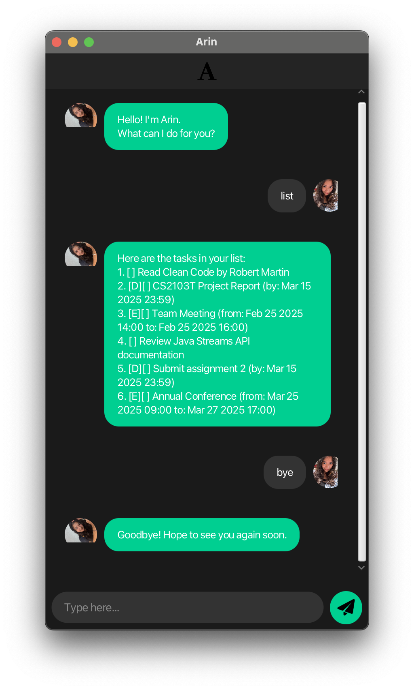

## Features

### 1. Task Management

💼 Task Creation

#### Adding Different Task Types
* `todo DESCRIPTION` - Adds a todo task
* `deadline DESCRIPTION /by YYYY-MM-DD HHmm` - Adds a deadline
* `event DESCRIPTION /from YYYY-MM-DD HHmm /to YYYY-MM-DD HHmm` - Adds an event

<table>
  <tr>
    <td>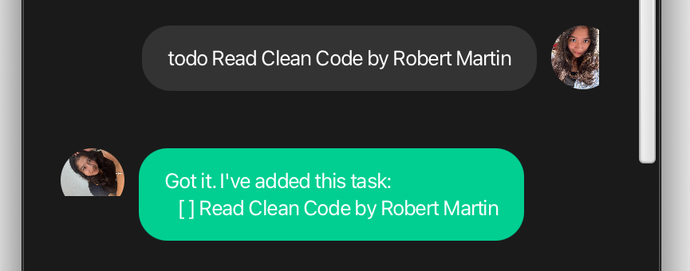 <em>Adding a todo task</em></td>
    <td>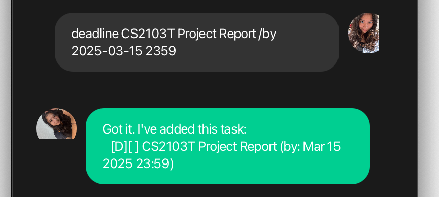 <em>Adding a deadline task</em></td>
  </tr>
  <tr>
    <td>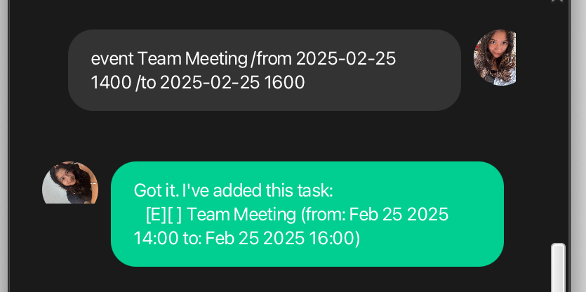 <em>Adding an event</em></td>
    <td>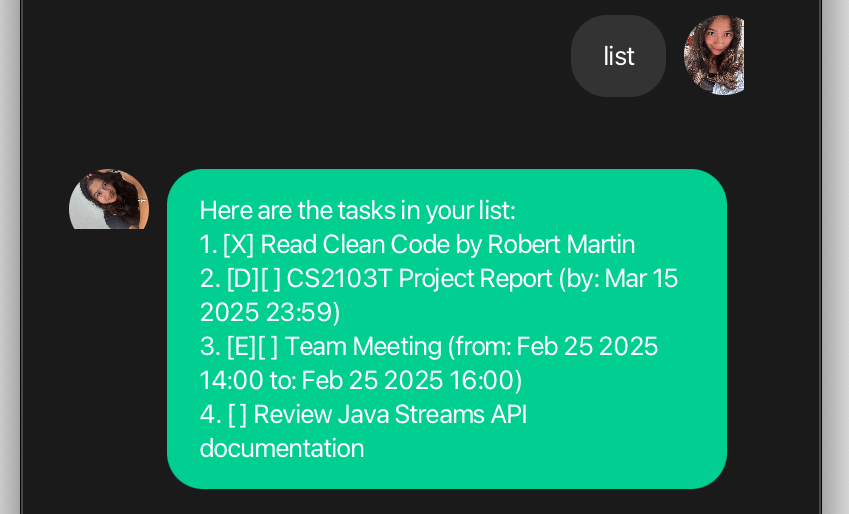 <em>Viewing all tasks</em></td>
  </tr>
</table>

✏️ Task Management

#### Managing Tasks
* `list` - Shows all tasks
* `mark INDEX` - Marks task as done (INDEX starts from 1)
* `unmark INDEX` - Marks task as not done
* `delete INDEX` - Deletes a task

<table>
  <tr>
    <td> <em>Marking tasks as complete</em></td>
    <td>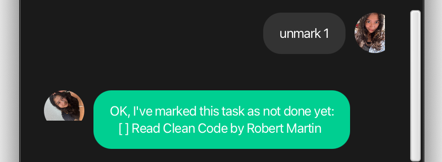 <em>Unmarking tasks</em></td>
  </tr>
</table>

### 2. Finding Tasks

🔍 Search & Filter

#### Search Options
* `find KEYWORD` - Finds tasks containing the keyword
* `upcoming [days]` - Shows tasks due within specified days (default: 7 days)

<table>
  <tr>
    <td>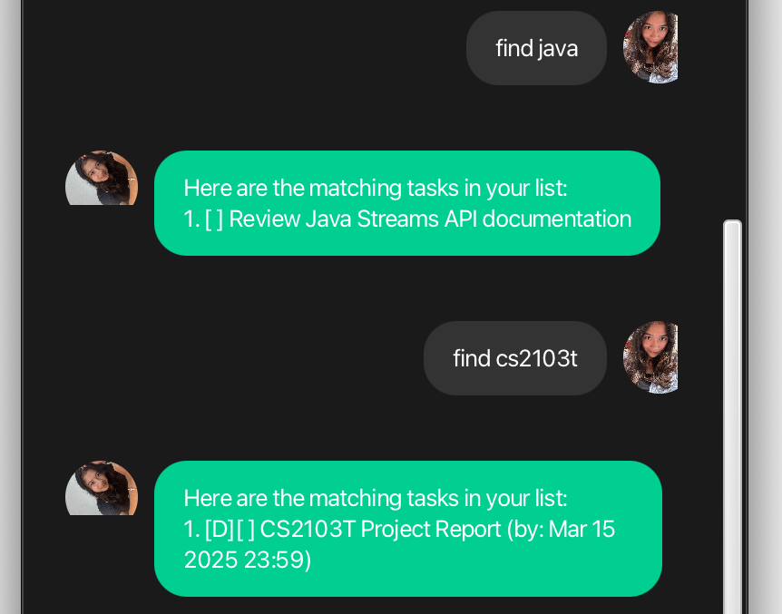 <em>Finding tasks by keyword</em></td>
    <td>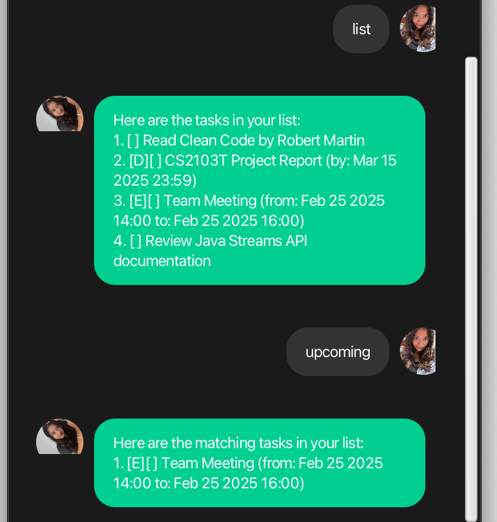 <em>Viewing upcoming tasks</em></td>
  </tr>
</table>

### 3. Sorting Tasks

🔄 Sorting Options

#### Available Sorting Criteria
* `sort by date` - Sorts tasks chronologically
* `sort by name` - Sorts tasks alphabetically
* `sort by type` - Sorts by task type (ToDo → Deadline → Event)
* `sort by status` - Sorts by completion status

<table>
  <tr>
    <td>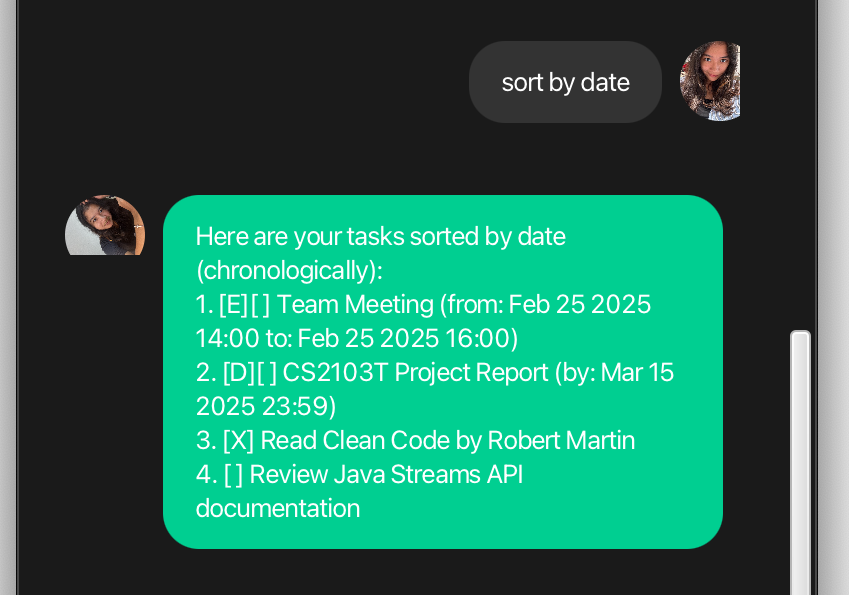 <em>Sorting by date</em></td>
    <td>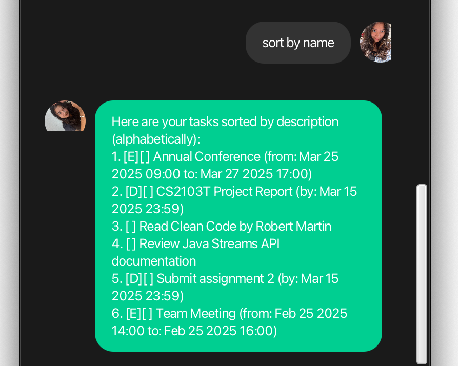 <em>Sorting by name</em></td>
  </tr>
  <tr>
    <td>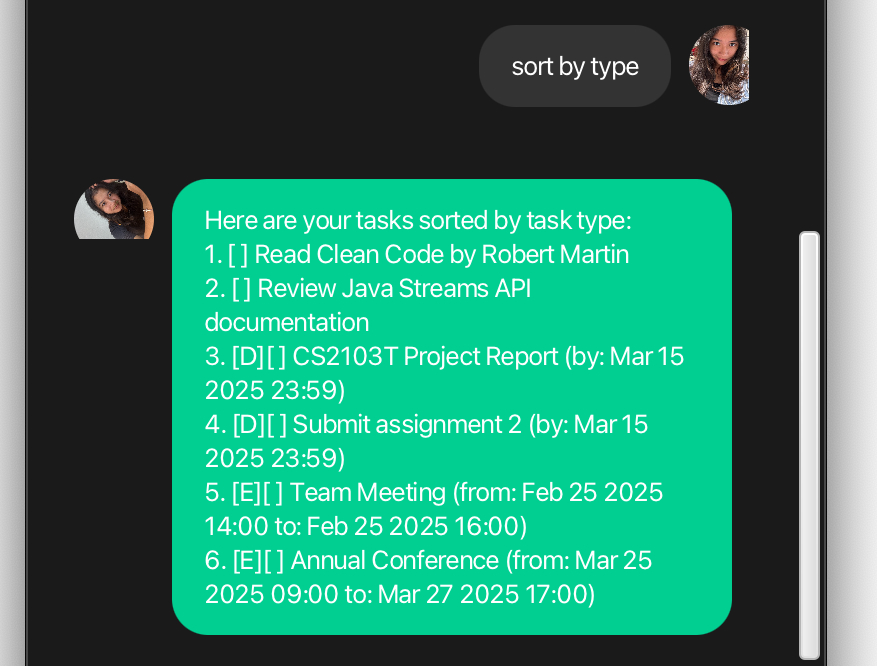 <em>Sorting by type</em></td>
    <td>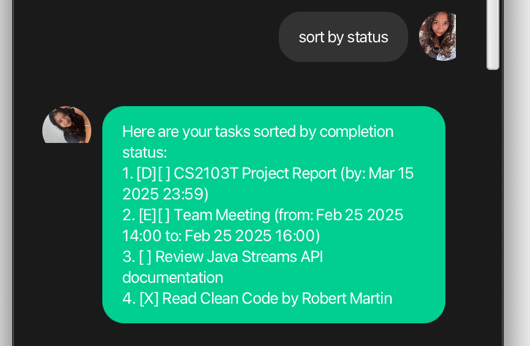 <em>Sorting by status</em></td>
  </tr>
</table>

### 4. Help Command

❓ Getting Help

#### Help Features
* `help` - Shows all available commands and their usage
* `bye` - Exits the application

  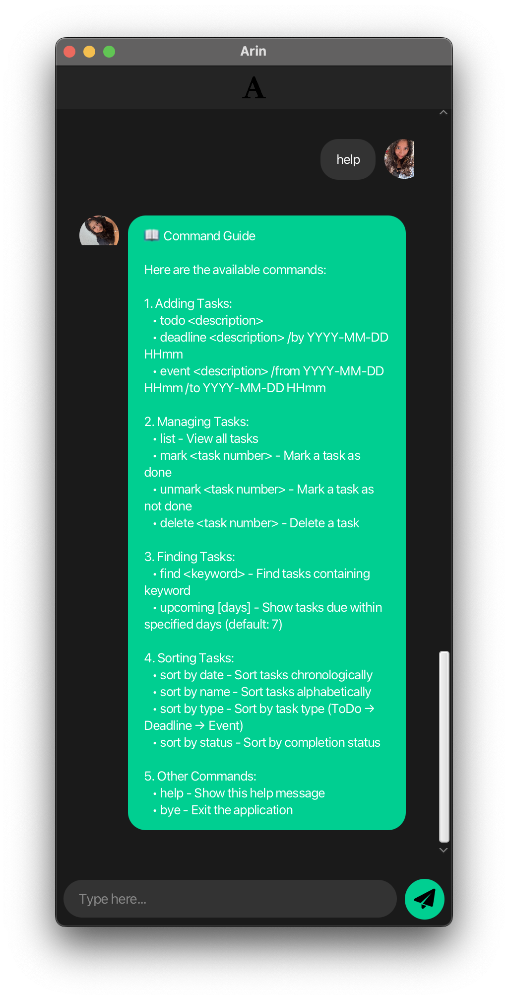
   
  <em>Comprehensive help message showing all available commands</em>

## Usage Notes

* Task indices start from 1 (e.g., use `mark 1` to mark the first task as done)
* Dates should be in the format YYYY-MM-DD HHmm (e.g., 2025-02-23 2359)
* For events, ensure the end time is after the start time

